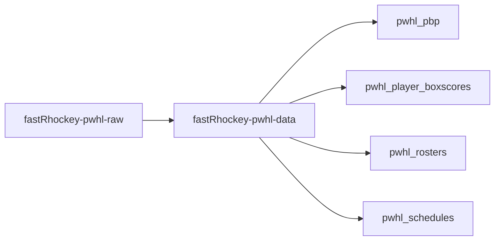
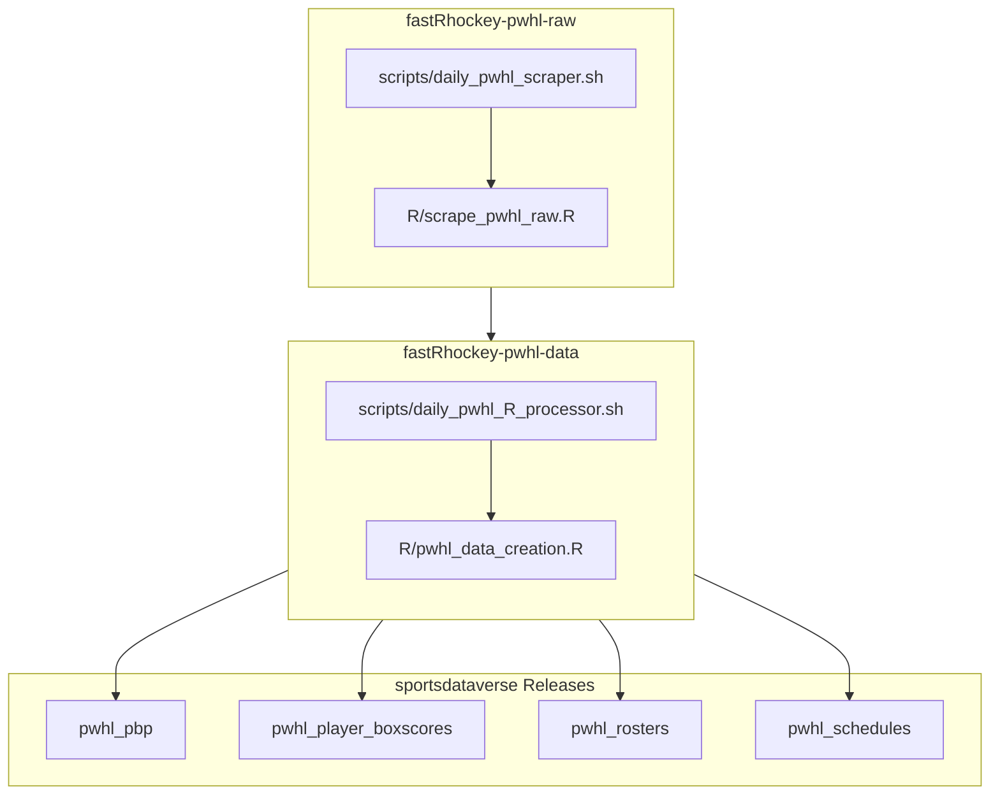

# fastRhockey-pwhl-raw

Raw PWHL game JSON data scraped from the HockeyTech API via [fastRhockey](https://github.com/sportsdataverse/fastRhockey).



## fastRhockey PWHL workflow diagram



## sportsdataverse-data releases

| Release tag | Content |
|-----|---------|
| [`pwhl_pbp`](https://github.com/sportsdataverse/sportsdataverse-data/releases/tag/pwhl_pbp) | PWHL play-by-play data |
| [`pwhl_player_boxscores`](https://github.com/sportsdataverse/sportsdataverse-data/releases/tag/pwhl_player_boxscores) | PWHL player box scores (skaters + goalies) |
| [`pwhl_rosters`](https://github.com/sportsdataverse/sportsdataverse-data/releases/tag/pwhl_rosters) | PWHL rosters |
| [`pwhl_schedules`](https://github.com/sportsdataverse/sportsdataverse-data/releases/tag/pwhl_schedules) | PWHL schedules |

## Structure

```
pwhl/
├── json/
│   ├── raw/              # Raw HockeyTech API responses per game
│   └── final/            # Processed via fastRhockey pipeline (PBP, box scores, game info)
├── schedules/
│   ├── rds/              # Season schedules (pwhl_schedule_{year}.rds)
│   └── parquet/          # Season schedules in parquet format
├── pwhl_schedule_master.rds      # Combined schedule across all seasons
└── pwhl_schedule_master.parquet
```

## Data Sources

- **HockeyTech statviewfeed** — play-by-play, game summary, schedule
- **HockeyTech gc feed** — game center summary (scoring, penalties, shots, three stars)

## Automation

- **Scraping workflow** runs daily during the PWHL season (Nov-May)
- On push, triggers the [fastRhockey-pwhl-data](https://github.com/sportsdataverse/fastRhockey-pwhl-data) repo to compile datasets

## Related repositories

[fastRhockey-pwhl-raw data repository (source: HockeyTech API)](https://github.com/sportsdataverse/fastRhockey-pwhl-raw)

[fastRhockey-pwhl-data repository (source: HockeyTech API)](https://github.com/sportsdataverse/fastRhockey-pwhl-data)

[fastRhockey-nhl-raw data repository (source: NHL API)](https://github.com/sportsdataverse/fastRhockey-nhl-raw)

[fastRhockey-nhl-data repository (source: NHL API)](https://github.com/sportsdataverse/fastRhockey-nhl-data)

[fastRhockey-data legacy repository (archived; sources: NHL Stats API + PHF)](https://github.com/sportsdataverse/fastRhockey-data)

## Part of the [SportsDataverse](https://sportsdataverse.org/)
